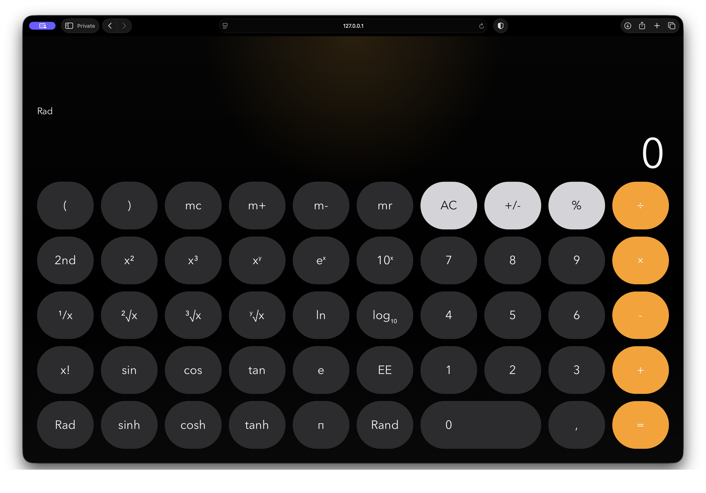

# Calcu

Calcu is a responsive calculator app built with React, TypeScript, Vite, Vitest, and Biome.



## Quick Start

For a freshly cloned repo:

```bash
npm install
npm run dev
```

Open the Vite URL printed in the terminal.

## Getting Started

Install dependencies:

```bash
npm install
```

Run the development server:

```bash
npm run dev
```

Open the app in the browser using the Vite URL printed in the terminal.

## Common Commands

```bash
npm run build
npm run preview
npm run lint
npm run format
npm run format:check
npm run typecheck
npm run test:run
npm run check
```

## Notes

- `npm run check` runs formatting, linting, type checking, and the Vitest suite in one pass.
- `npm run dev` is the primary local workflow for UI development.
- The calculator logic is isolated under `src/features/calculator/`, while the app shell lives under `src/app/`.
