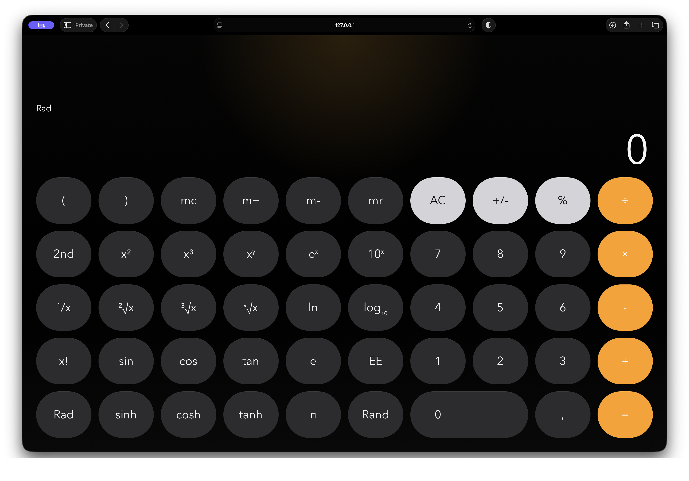

# Calcu

Calcu is a responsive calculator app built with React, TypeScript, Vite, Vitest, and Biome.




## Quick Start

For a freshly cloned repo:

```bash
npm install
npm run dev
```

Open the Vite URL printed in the terminal.

## Getting Started

Install dependencies:

```bash
npm install
```

Run the development server:

```bash
npm run dev
```

Open the app in the browser using the Vite URL printed in the terminal.

## Common Commands

```bash
npm run build
npm run preview
npm run lint
npm run format
npm run format:check
npm run typecheck
npm run test:run
npm run test:coverage
npm run check
```

## Notes

### Experimental Codex + ASP demo

An opt-in local demo connects a natural-language task panel to exact Codex CLI
`0.145.0` with `gpt-5.6-luna` at `low` effort. Codex can call one typed
`calculation_propose` tool; Calcu independently admits it through a development
ASP Grant/session and loopback HTTPS boundary. The ordinary calculator still
works without Codex or the local host.

After authenticating the exact CLI version, run:

```sh
npm run agent:demo
```

Task text is sent to the configured model provider. ASP authority remains in the
local server process. This Compatibility Bearer experiment is not production
certification. See the [adoption report](./docs/ASP_ADOPTION_REPORT.md),
[boundary documentation](./server/README.md), and
[staged implementation plan](./SPECS/ASP_DEMO_PLAN.md).

### Repository notes

- `npm run check` runs formatting, linting, type checking, and the Vitest suite in one pass.
- `npm run test:coverage` produces the coverage report used by Flow and CI.
- `npm run dev` is the primary local workflow for UI development.
- Flow configuration lives in [`.flow/params.yaml`](./.flow/params.yaml).
- The calculator logic is isolated under `src/features/calculator/`, while the app shell lives under `src/app/`.
